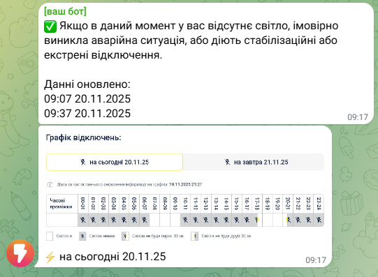

# detek-to-telegram

[](https://opensource.org/licenses/MIT)
[](https://github.com/riv-gh/detek-to-telegram)

## 🌐 Languages
- [English](README.md)
- [Русский](README.ru.md)
- [Українська](README.uk.md)



A small service that forwards notifications (charts and messages) about power outages to Telegram.

## Features
- Forwards text notifications to a specified Telegram chat.
- Simple configuration via environment variables.

## Quick start

1. Create a Telegram bot via BotFather and get the token.
2. Find out the chat_id (send a message to the bot and check the log).
3. Set environment variables and start the application.

Example (Linux/macOS):
```
export TELEGRAM_TOKEN=123456:ABC-DEF...
export TELEGRAM_CHAT_ID=-1001234567890
...
npm start
```

Windows (PowerShell):
```
$env:TELEGRAM_TOKEN = "123456:ABC-DEF..."
$env:TELEGRAM_CHAT_ID = "-1001234567890"
...
npm start
```

## Environment variables (.env)
- TELEGRAM_BOT_TOKEN — bot token
- CHAT_ID — chat id
- CHAT_ID_GROUP — group or channel id
- CITY — city (can be omitted for Kyiv)
- STREET — street name
- HOUSE — house number
